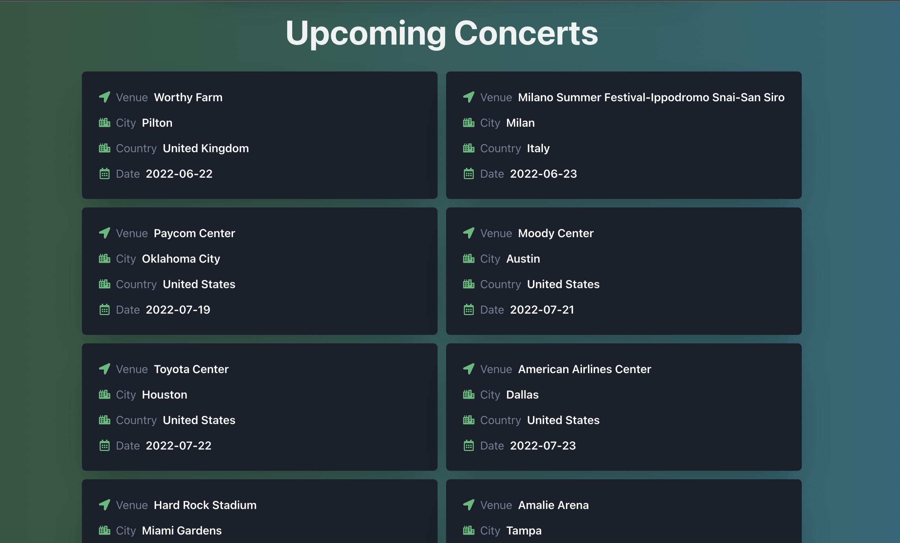

# Actallery
A gallery for musicians

Visit the app: [Actallery](https://actallery.web.app)

<br/>

## How To Run
1. cd into the root of the dir, where `package.json` file sits.

2. install dependencies
```
$ yarn install
```
3. run the project in developer mode
```
$ yarn dev
```
4. to build the project
```
$ yarn build
```

### Testing
5. to run the tests
```
$ yarn test
```
6. to see the coverage alongwith tests
```
$ yarn coverage
```

<br/>

## Tech
- Vite
- React
- Chakra UI
- ~~Jest~~ Vitest

<br/>

## TODOs
- Basic requirements ✅
- UI ✅
- Testing ✅
- Dark theme ✅
- Cache or data persistance on reloads ✅
- Deployment ✅

<br/>

## Fixes
- pick fb link from links array using Array.filter() ✅

<br/>

## Display
- Search View (light)


<br/>
<br/>

- Search View (dark)


<br/>
<br/>

- Events View



<br/>
<br/>

- Search View Mobile


<br/>
<br/>

- Events View Mobile


